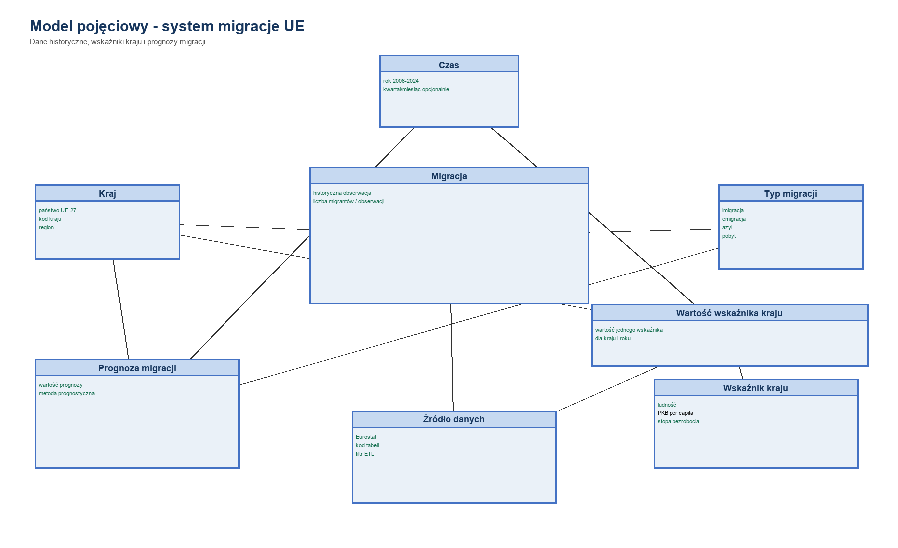
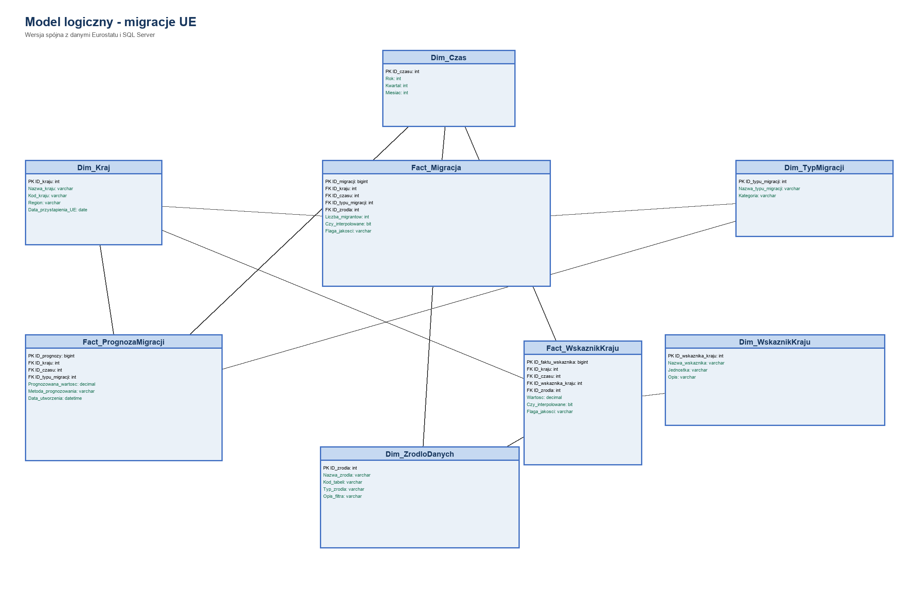
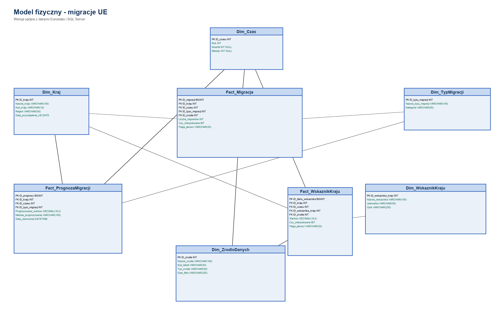
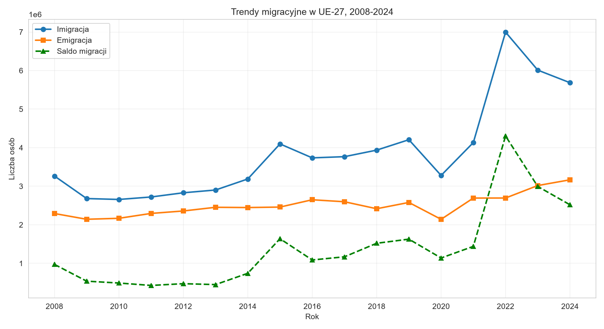
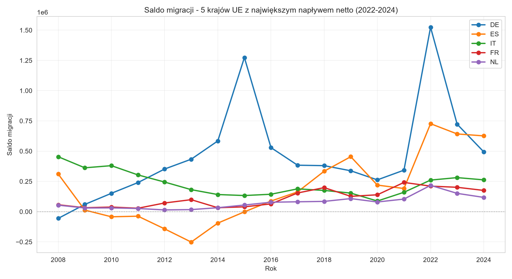
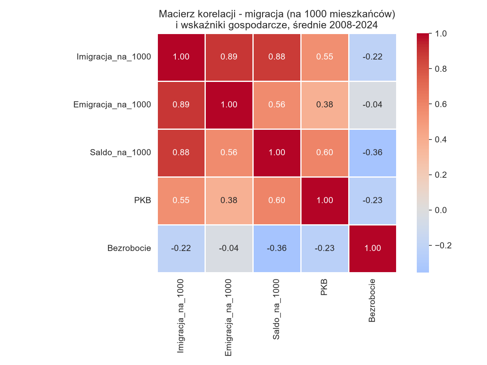
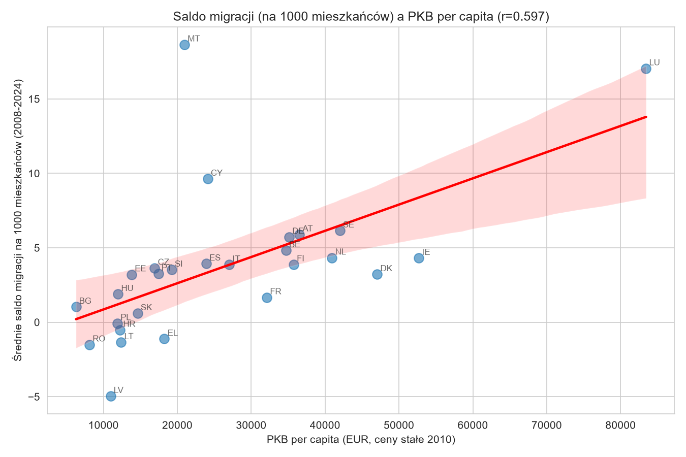
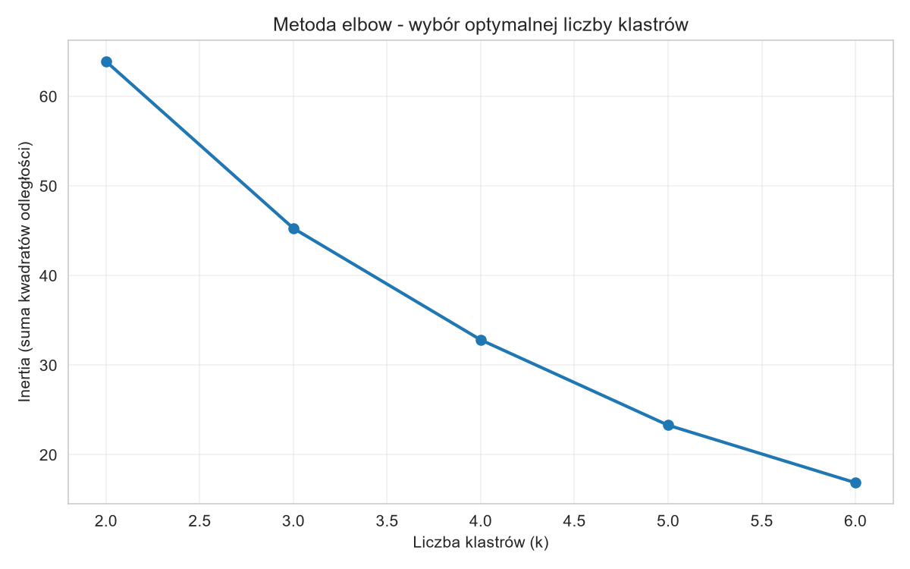
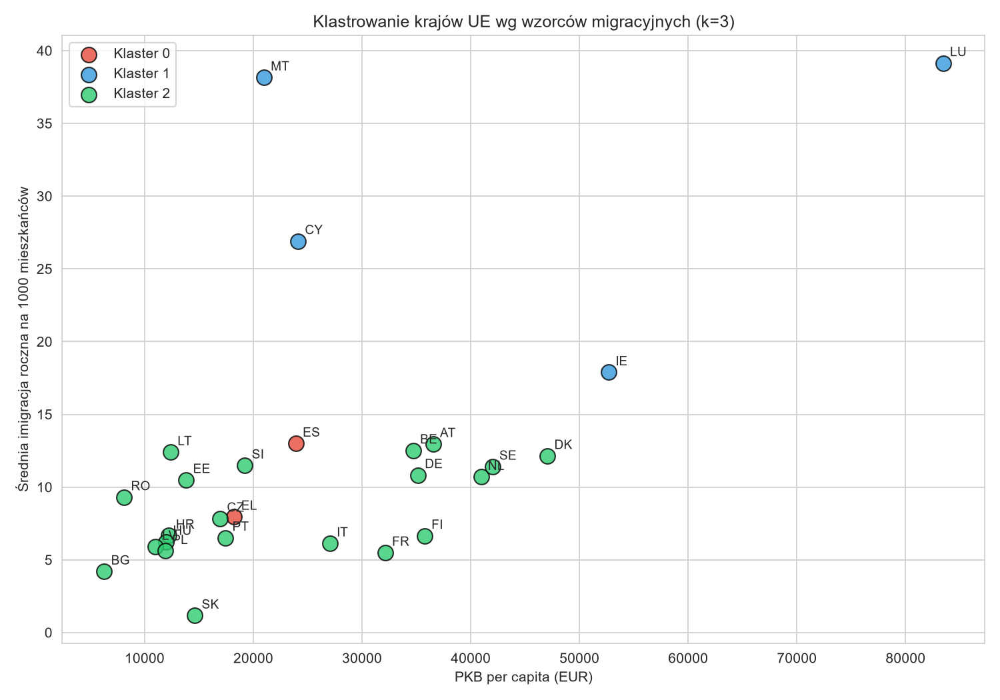

# Hurtownia danych i prognozowanie migracji w UE

Projekt przedstawia proces budowy hurtowni danych do analizy migracji w krajach Unii Europejskiej. Obejmuje przygotowanie danych Eurostatu, załadowanie ich do SQL Server, analizę trendów migracyjnych oraz prognozowanie imigracji i emigracji na lata 2025-2029.

## Zakres projektu

- ETL danych Eurostatu w Pythonie
- model hurtowni danych w SQL Server
- tabele wymiarów i faktów
- widok SQL do liczenia salda migracji
- analiza trendów migracyjnych w UE-27
- analiza korelacji migracji z PKB per capita i bezrobociem
- klasteryzacja krajów metodą KMeans
- prognozowanie migracji metodami ARIMA, Holt i Random Forest
- zapis prognoz do tabeli faktów w SQL Server

## Technologie

Python, pandas, NumPy, SQLAlchemy, pyodbc, SQL Server, T-SQL, scikit-learn, statsmodels, matplotlib, seaborn, KMeans, Random Forest, ARIMA, Holt / Exponential Smoothing

## Dane

Źródłem danych są pliki Eurostatu w formacie TSV/GZ. W projekcie wykorzystano dane dotyczące imigracji, emigracji, liczby ludności, PKB per capita oraz stopy bezrobocia.

Analiza obejmuje kraje UE-27 oraz lata 2008-2024. Dane wejściowe nie są częścią repozytorium - należy pobrać je z Eurostatu i wskazać lokalną ścieżkę w konfiguracji skryptów.

## Struktura projektu

```text
.
├── Python/
│   ├── ETL.py
│   ├── Analiza_trendow.py
│   └── prognoza_migracje_UE.py
├── SQL/
│   └── SQLQuery1.sql
├── Modele/
│   ├── FINAL_Model_pojeciowy.png
│   ├── FINAL_Model_logiczny.png
│   ├── FINAL_Model_fizyczny.png
│   └── FINAL_Projekt_systemu_migracje_UE.docx
├── Wykresy/
│   ├── 01_trend_UE_ogolem.png
│   ├── 02_top5_saldo.png
│   ├── 03_macierz_korelacji.png
│   ├── 04_saldo_vs_pkb.png
│   ├── 05_elbow_plot.png
│   └── 06_klastry_kraje.png
└── README.md
```

## Opis plików

### Python/ETL.py

Skrypt odpowiedzialny za proces ETL. Wczytuje pliki Eurostatu `.tsv.gz`, filtruje dane do krajów UE-27 i lat 2008-2024, czyści dane, obsługuje braki, wykonuje interpolację brakujących wartości, buduje tabele wymiarów i faktów oraz ładuje dane do SQL Server.

### SQL/SQLQuery1.sql

Skrypt SQL tworzący strukturę hurtowni danych w SQL Server. Zawiera tabele wymiarów, tabele faktów, klucze główne i obce, indeksy, widok `V_Saldo_Migracji` oraz przykładowe zapytania analityczne.

Główne tabele:

- `Dim_Kraj`
- `Dim_Czas`
- `Dim_TypMigracji`
- `Dim_ZrodloDanych`
- `Dim_WskaznikKraju`
- `Fact_Migracja`
- `Fact_WskaznikKraju`
- `Fact_PrognozaMigracji`

### Python/Analiza_trendow.py

Skrypt analityczny, który pobiera dane z hurtowni SQL Server i wykonuje analizę trendów imigracji, emigracji i salda migracji, przeliczenia na 1000 mieszkańców, analizę korelacji z PKB i bezrobociem, wizualizacje wyników oraz klasteryzację krajów UE metodą KMeans.

### Python/prognoza_migracje_UE.py

Skrypt odpowiedzialny za prognozowanie migracji na lata 2025-2029. Wykorzystuje modele ARIMA, Holt / Exponential Smoothing oraz Random Forest z użyciem PKB per capita i stopy bezrobocia. Wyniki prognoz są zapisywane do tabeli `Fact_PrognozaMigracji`.

## Model hurtowni danych

Projekt wykorzystuje model z tabelami wymiarów i faktów. Tabele wymiarów przechowują informacje o krajach, czasie, typach migracji, źródłach danych i wskaźnikach gospodarczych. Tabele faktów przechowują historyczne dane migracyjne, wartości wskaźników krajów oraz prognozy migracji.

### Model pojęciowy



### Model logiczny



### Model fizyczny



Saldo migracji nie jest zapisane jako osobna kolumna, tylko liczone w widoku SQL `V_Saldo_Migracji` jako różnica między imigracją i emigracją.

## Analiza danych

W ramach analizy przygotowano wizualizacje trendów migracyjnych, korelacji oraz klasteryzacji krajów UE.

### Trendy migracyjne w UE-27



### Top 5 krajów z najwyższym saldem migracji



### Macierz korelacji



### Saldo migracji a PKB per capita



### Metoda elbow dla KMeans



### Klasteryzacja krajów UE



## Uruchomienie

### 1. Instalacja bibliotek

```bash
pip install pandas numpy sqlalchemy pyodbc scikit-learn statsmodels matplotlib seaborn scipy
```

### 2. Utworzenie bazy danych

Uruchom skrypt SQL w SQL Server Management Studio:

```text
SQL/SQLQuery1.sql
```

### 3. Konfiguracja ścieżek

W plikach Python należy sprawdzić wartości:

```python
FOLDER = r'C:\Users\Roksa\Desktop\praza_inzDANE'
SERWER = 'localhost'
BAZA = 'HurtowniaMigracje'
```

`FOLDER` powinien wskazywać folder z plikami danych Eurostatu.

### 4. Uruchomienie ETL

```bash
python Python/ETL.py
```

### 5. Uruchomienie analizy

```bash
python Python/Analiza_trendow.py
```

### 6. Uruchomienie prognozowania

```bash
python Python/prognoza_migracje_UE.py
```

## Przykładowe zapytania SQL

Saldo migracji dla wybranego kraju:

```sql
SELECT *
FROM V_Saldo_Migracji
WHERE ID_kraju = 1;
```

Prognoza imigracji dla Polski:

```sql
SELECT
    dk.Kod_kraju,
    dc.Rok,
    fp.Prognozowana_wartosc,
    fp.Metoda_prognozowania
FROM Fact_PrognozaMigracji fp
JOIN Dim_Kraj dk ON fp.ID_kraju = dk.ID_kraju
JOIN Dim_Czas dc ON fp.ID_czasu = dc.ID_czasu
WHERE dk.Kod_kraju = 'PL'
  AND fp.ID_typu_migracji = 1
ORDER BY dc.Rok, fp.Metoda_prognozowania;
```

## Najważniejsze elementy projektu

- zaprojektowanie hurtowni danych w SQL Server
- przygotowanie procesu ETL w Pythonie
- przetwarzanie danych Eurostatu z plików `.tsv.gz`
- interpolacja braków danych
- analiza trendów migracyjnych UE-27
- analiza korelacji z PKB i bezrobociem
- klasteryzacja krajów metodą KMeans
- prognozowanie migracji metodami ARIMA, Holt i Random Forest
- zapis prognoz do SQL Server

## Wnioski

Projekt pokazuje pełny proces pracy z danymi: od przygotowania hurtowni danych i ETL, przez analizę eksploracyjną, aż po budowę modeli prognostycznych. Łączy pracę z SQL Server, Pythonem i metodami analizy danych.
